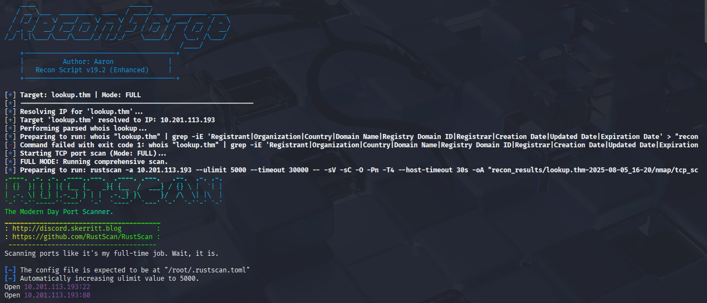

# 🛡️ **ReconForge** — *Elite Network & Web Recon Toolkit*

---

### 📦 Version: `v2.0` — *Consolidated & Complete Edition*  
👤 Author: [**Aaron**](https://github.com/aaron-631)  
📄 License: [**MIT**](https://github.com/aaron-631/ReconForge/blob/main/LICENSE)

---

<p align="center">
  
  
  
  
  
</p>


</div>
📚 Table of Contents

* [Overview](#-overview)
* [Screenshots](#-screenshots)
* [Installation](#-installation)
* [Features at a Glance](#-features-at-a-glance)
* [Advanced & Unique Features](#-advanced--unique-features)
* [Output Structure](#-output-structure)
* [How to Use](#-how-to-use)
* [Reporting & Logs](#-reporting--logs)
* [Tools Integrated](#-tools-integrated)
* [Suggested Workflow](#-suggested-workflow)
* [Tested On](#-tested-on)
* [License](#-license)
* [Legal Disclaimer](#-legal-disclaimer)
* [Feedback / Contributions](#-feedback--contributions)

---

## 🌐 Overview

**ReconForge** isn't just another recon script. It's a **battle-tested**, **modular**, and **sharp-edged reconnaissance toolkit** forged for **CTF warriors**, **bug bounty hunters**, and **real-world pentesters**.

From passive WHOIS sweeps to precision-tuned FFUF fuzzing, ReconForge is built to **dig deep, stay organized, and never miss a surface**. Whether you're mapping a target for a red team op or poking at a box during a CTF finals at 2 AM — this toolkit has your back.

---

## 📸 Screenshots

### 🔧 Terminal Output (ReconForge in Action)


### 📄 Generated Report (HTML View)


---

## 🧰 Installation

### 1️⃣ Clone the Repo

```bash
git clone https://github.com/aaron-631/reconforge.git
cd reconforge
chmod +x reconforge.sh
```

### 2️⃣ Install Required Tools

```bash
sudo apt update && sudo apt install -y figlet nmap rustscan ffuf whatweb tree curl whois jq pandoc openssl


```
## 🚀 Features at a Glance

### 🧭 Passive Recon

* WHOIS lookup (raw + parsed)
* DNS info via `dig`, `nslookup`
* Preserves **raw WHOIS dumps** for deeper offline parsing

### ⚡ Active Network Scanning

* 🔥 Blazing fast port detection via `rustscan`
* 🔍 Deep service enumeration with `nmap`

### 🌐 Web Enumeration

* Web fingerprinting with `WhatWeb`
* Subdomain brute-forcing (custom/default wordlists)
* `robots.txt`, `sitemap.xml`, HTTP headers, and more
* Calibrated and **auto-filtered** directory brute-force via `ffuf`

### 📊 Beautiful Reporting

* Generates clean **Markdown + HTML reports** with `pandoc`
* Structured logs + machine-readable JSON via `jq`

### 🛠️ Flexible Scan Modes

* Silent Mode (no noise)
* Dry-run Preview (see what will run)
* Lite Mode (skip heavy modules)
* Minimal Mode (just open ports)

### 🔒 Clean, Modular, and Error-Handled

* Smart timeout handling, graceful exits
* Structured output folders for easy archival and collaboration

---

## 🎯 Advanced & Unique Features

### 🧠 Intelligent FFUF Calibration

Before directory or subdomain fuzzing, ReconForge probes a random, likely non-existent URL path. If the target returns a non-standard 404 or wildcard DNS is detected, it auto-tunes FFUF filters using response code (`-fc`), response size (`-fs`), and word count (`-fw`). This **minimizes false positives** and improves scan accuracy.

### 🎭 Randomized User-Agent Rotation

To reduce detection by WAFs and basic rate-limiting systems, ReconForge rotates through a curated list of realistic User-Agent strings (e.g., Chrome, Firefox, Safari) for tools like `curl`, `ffuf`, and `WhatWeb`.

### 📜 Structured JSON Parsing with `jq`

All `ffuf` results are captured in structured JSON format and parsed using `jq`, enabling:

* Clean reporting of discovered directories and subdomains
* Easy integration with external analysis pipelines or dashboards
* JSON summaries included directly in the report for full transparency

### 🧬 Wildcard DNS Auto-Detection

Before launching subdomain brute-forcing, the script generates a unique random subdomain and checks if the target resolves it. If a response is received, **wildcard DNS behavior is detected**, and the scan is skipped to avoid invalid results.

### 🧪 Dry-Run Command Preview Mode

With the `--dry-run` flag, you can preview **every command the script will execute** (including dynamic arguments) without running them.

### 📊 Dual-Format Reporting (Markdown + HTML)

ReconForge generates reports in both human-readable `Markdown` and styled `HTML` formats:

* `SUMMARY.md`: Clear breakdown of open ports, whois info, web technologies, sitemap contents, and more.
* `REPORT.html`: Automatically created using `pandoc` with a clean dark theme via Water.css.

### 🗂️ Organized Output Structure with Timestamps

Every scan creates a timestamped directory (`recon_results/target.com-YYYY-MM-DD/`) with clear subfolders for:

* `nmap/` (port scans)
* `web/` (HTTP fingerprints, FFUF results, robots.txt, sitemap.xml)
* `subdomains/` (subdomain enumeration results)
* `passive/` (WHOIS data)
* `scan.log` (all commands executed)
* `SUMMARY.md` & `REPORT.html`

---

## 📁 Output Structure

```
recon_results/
├── target.com-2025-08-05/
│   ├── passive/
│   ├── nmap/
│   ├── web/
│   ├── subdomains/
│   ├── screenshots/
│   ├── SUMMARY.md
│   ├── REPORT.html
│   └── scan.log
```


> 🧠 **Pro tip:** Install everything inside a fresh VM or container for maximum control.

---

## ⚙️ How to Use

### 🔧 Basic Syntax

```bash
./reconforge.sh -d <domain_or_ip> [options]
```

### ✅ Required Argument

| Flag          | Description                                          |
| ------------- | ---------------------------------------------------- |
| `-d <target>` | Target IP or domain (e.g. `example.com`, `10.0.0.1`) |

### 🔀 Optional Modes & Flags

| Flag         | Description                           |
| ------------ | ------------------------------------- |
| `-s`         | Enable subdomain enumeration          |
| `-l`         | Lite scan (skips web modules)         |
| `-m`         | Minimal scan (just ports)             |
| `--dry-run`  | Preview the full command flow         |
| `--silent`   | Silent terminal mode (minimal output) |
| `-w <file>`  | Custom wordlist for directory fuzzing |
| `-sw <file>` | Custom wordlist for subdomain fuzzing |
| `--no-html`  | Skip HTML report generation           |

### 🧪 Examples

```bash
# Full recon with subdomains
./reconforge.sh -d example.com -s

# Use custom wordlist for directory fuzzing
./reconforge.sh -d example.com -w ~/lists/common.txt

# Dry-run to preview everything
./reconforge.sh -d example.com --dry-run

# Minimal port scan
./reconforge.sh -d 192.168.0.101 -m
```

---

## 📊 Reporting & Logs

Every scan generates:

* `SUMMARY.md` — human-readable breakdown
* `REPORT.html` — styled report for quick browsing/sharing
* `scan.log` — raw execution + output history
* Tool outputs stored per module (`nmap/`, `web/`, etc.)
* `jq`-powered JSON summaries for integrations or scripts

---

## 🔌 Tools Integrated

| Tool             | Function                           |
| ---------------- | ---------------------------------- |
| `nmap`           | Service detection + deep scans     |
| `rustscan`       | Fast TCP port scanner              |
| `ffuf`           | Fuzzing directories + subdomains   |
| `whatweb`        | Web tech fingerprinting            |
| `whois`          | WHOIS info gathering               |
| `jq`             | JSON parsing + formatting          |
| `pandoc`         | HTML/Markdown reporting            |
| `dig`/`nslookup` | DNS record enumeration             |
| `curl`           | HTTP header probing + quick checks |

---

## 🔁 Suggested Workflow

```bash
# 1. Start a recon
./reconforge.sh -d target.com -s

# 2. Open the output
cd recon_results/target.com-2025-08-05/

# 3. Read the summary
cat SUMMARY.md

# 4. Open the report
xdg-open REPORT.html
```

---

## 💻 Tested On

* ✅ Kali Linux
* ✅ Parrot OS
* ✅ Ubuntu 20.04 and above

Works well for **both internal networks** and **public-facing apps**.

---

## 📜 License

Licensed under the **MIT License**.
Check the [LICENSE](./LICENSE) file for more details.

---

## ⚠️ Legal Disclaimer

> This script is meant strictly for **educational purposes** and **authorized penetration testing**.
> **Do not** run this on systems you don’t own or have explicit permission to test. Unauthorized access is illegal.

---

## 💬 Feedback / Contributions

Got ideas? Found a bug? Want to make it even better?

* Open an [Issue](https://github.com/aaron-631/reconforge/issues)
* Submit a Pull Request
* Reach out via:

  * GitHub: [@aaron-631](https://github.com/aaron-631)
  * Email: [your.email@domain.com](mailto:your.email@domain.com)

---

**Built with discipline, curiosity, and a bit of caffeine.**
— **Aaron | ReconForge v19.0 | 2025**


